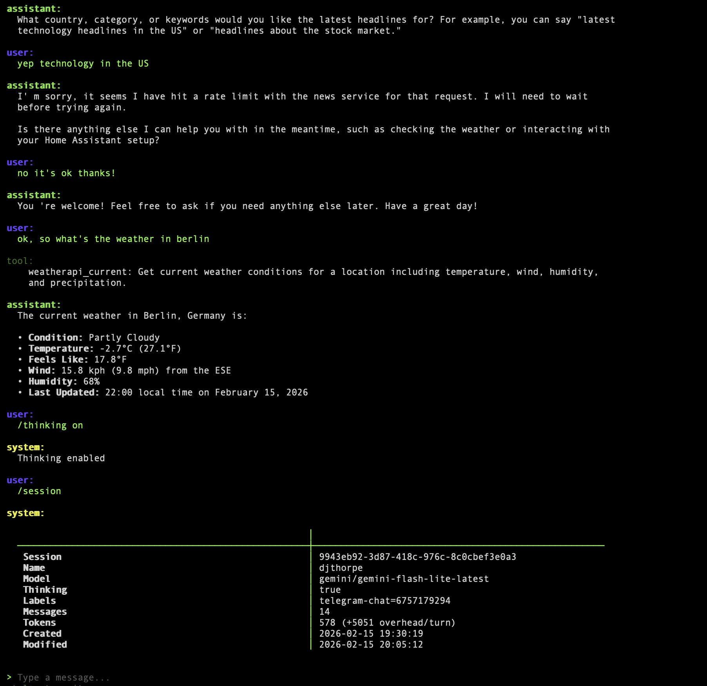
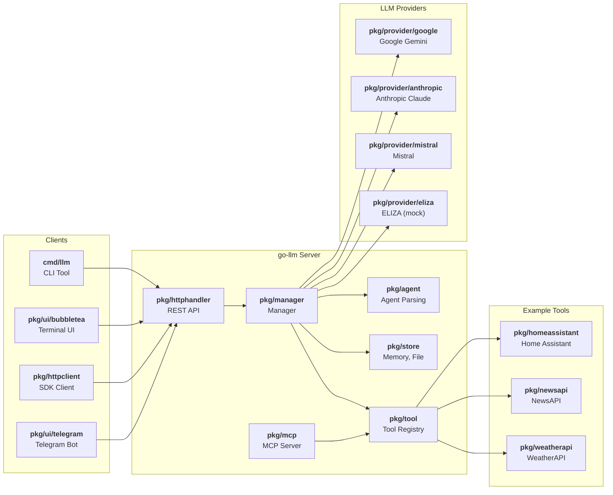

# go-llm

[](https://pkg.go.dev/github.com/mutablelogic/go-llm)
[](LICENSE)

A multi-provider LLM tool and SDK for Go.

Interact with large language models from Google Gemini, Anthropic Claude, and Mistral through a
unified CLI, HTTP API server, or Go SDK. Supports stateless completion (`ask`), stateful
multi-turn conversations (`chat`), embeddings, tool use, MCP integration, and a Telegram bot.

## Features

- **Multi-Provider**: Unified interface across Google Gemini, Anthropic Claude, and Mistral
- **CLI**: Interactive terminal UI chat with markdown rendering, single-shot ask, and embedding generation
- **HTTP API Server**: REST endpoints for models, sessions, tools, chat, ask, and embeddings with SSE streaming
- **Session Management**: Stateful multi-turn conversations with persistent storage (file-backed JSON)
- **Tool Use**: Extensible tool framework with built-in integrations for Home Assistant, NewsAPI, and WeatherAPI
- **MCP Server**: Model Context Protocol (stdio JSON-RPC 2.0) server exposing registered tools and prompts
- **Telegram Bot**: Full-featured bot with per-conversation sessions, file/image attachments, and slash commands
- **Attachments**: Send files, images, and URLs as context in chat and ask
- **Agents**: Reusable, versioned task definitions with input/output schemas, Go templates, and tool selection
- **Structured Output**: JSON schema-based structured output for ask and agents
- **Thinking/Reasoning**: Extended thinking support with configurable budgets (Anthropic, Gemini)
- **OpenTelemetry**: Distributed tracing support for the HTTP API

## Quick Start

### Server

The server provides the REST API for all providers and tools. Run it with Docker:

```bash
docker volume create go-llm
docker run -d --name go-llm \
  -v go-llm:/data -p 8085:8085 \
  -e GEMINI_API_KEY="your-key" \
  ghcr.io/mutablelogic/llm run
```

### Client

The client-only CLI can be downloaded from the [releases page](https://github.com/mutablelogic/go-llm/releases), or use `go install -tags client github.com/mutablelogic/go-llm/cmd/llm@latest`. It does not include the server or the Telegram bot. Point it at a running server:

```bash
export LLM_ADDR="localhost:8085"

# List providers and models
llm providers
llm models

# Single-shot completion
llm ask --model gemini-2.0-flash "Explain KV cache in two sentences"

# Interactive chat (launches terminal UI)
llm chat --model gemini-2.0-flash

# Single-shot chat with session persistence
llm chat --model gemini-2.0-flash "What is the capital of France?"

# Generate embeddings
llm embedding --model text-embedding-004 "Hello, world"
```

### Telegram Bot

The Telegram bot runs as a sidecar to the server, providing chat access via Telegram. It requires a bot token from [@BotFather](https://t.me/BotFather):

```bash
docker run -d --name go-llm-telegram \
  -e LLM_ADDR="your-server:8085" \
  -e TELEGRAM_TOKEN="your-bot-token" \
  ghcr.io/mutablelogic/llm telegram --model gemini-2.0-flash
```

## Server Configuration

### Providers

Providers are sources of models and generation capabilities. Some providers may support additional features like thinking/reasoning, tool use and embeddings. API keys for access to provider models are configured on the server via flags or environment variables:

| Provider | Flag | Env Variable | Models |
|----------|------|-------------|--------|
| **Google Gemini** | `--gemini-api-key` | `GEMINI_API_KEY` | Gemini 2.0 Flash, Flash Lite, embedding models, etc. |
| **Anthropic Claude** | `--anthropic-api-key` | `ANTHROPIC_API_KEY` | Claude Sonnet, Haiku, Opus, etc. |
| **Mistral** | `--mistral-api-key` | `MISTRAL_API_KEY` | Mistral Large, Small, embedding models, etc. |
| **ELIZA** | `--eliza` | *(none)* | Mock provider based on Weizenbaum's 1966 chatbot; no API key needed (en, de, fr) |

### Tools

Tools are external functions that can be called by the agent during generation. They are registered with the agent and exposed via the API and MCP server. Tools can be configured with flags or environment variables as needed for authentication or connection details. The following tools are included as examples of how to build tool integrations with the SDK:

| Tool | Flag | Env Variable | Description |
|------|------|-------------|-------------|
| **Home Assistant** | `--ha-endpoint`, `--ha-token` | `HA_ENDPOINT`, `HA_TOKEN` | Query and control smart home devices |
| **NewsAPI** | `--news-api-key` | `NEWS_API_KEY` | Search news articles and sources |
| **WeatherAPI** | `--weather-api-key` | `WEATHER_API_KEY` | Current weather and forecasts |

### HTTP & TLS

| Flag | Env Variable | Default | Description |
|------|-------------|---------|-------------|
| `--http.addr` | `LLM_ADDR` | `localhost:8085` | HTTP listen address |
| `--http.prefix` | — | `/api` | HTTP path prefix |
| `--http.timeout` | — | `15m` | HTTP read/write timeout |
| `--http.origin` | — | (same-origin) | CORS origin (`*` to allow all) |
| `--tls.name` | — | — | TLS server name |
| `--tls.cert` | — | — | TLS certificate file |
| `--tls.key` | — | — | TLS key file |

### Observability

| Flag | Env Variable | Description |
|------|-------------|-------------|
| `--otel.endpoint` | `OTEL_EXPORTER_OTLP_ENDPOINT` | OpenTelemetry collector endpoint |
| `--otel.header` | `OTEL_EXPORTER_OTLP_HEADERS` | OpenTelemetry collector headers |
| `--otel.name` | `OTEL_SERVICE_NAME` | OpenTelemetry service name |

Sessions and defaults are stored in `$XDG_CACHE_HOME` (or system temp if unset).

## CLI Commands

The `llm` command-line tool can connect to any running go-llm server (set `LLM_ADDR` or `--http.addr` to point at it) and provides commands for generating text, managing models and sessions, inspecting tools, and running the server itself.

### Generate

| Command | Description | Example |
|---------|-------------|---------|
| `ask` | Stateless single-shot completion | `llm ask --model gemini-2.0-flash --file "*.go" "Summarize this source code"` |
| `chat` | Stateful chat (terminal UI or single-shot) | `llm chat --model gemini-2.0-flash` |
| `embedding` | Generate embedding vectors | `llm embedding --model text-embedding-004 "text"` |

### Model

| Command | Description | Example |
|---------|-------------|---------|
| `providers` | List available providers | `llm providers` |
| `models` | List models | `llm models` |
| `model` | Get model details | `llm model gemini-2.0-flash` |

### Session

Sessions represent stateful conversations with context and memory. They can be managed via the CLI or API, and are persisted on the server for later retrieval.

| Command | Description | Example |
|---------|-------------|---------|
| `sessions` | List sessions | `llm sessions` |
| `session` | Get session details | `llm session <id>` |
| `create-session` | Create a new session | `llm create-session gemini-2.0-flash` |
| `update-session` | Update session metadata | `llm update-session <id>` |
| `delete-session` | Delete a session | `llm delete-session <id>` |

### Tool

| Command | Description | Example |
|---------|-------------|---------|
| `tools` | List registered tools | `llm tools` |
| `tool` | Get tool details | `llm tool <name>` |

### Agent

Agents are reusable, versioned task definitions that bundle a model, system prompt,
optional input/output JSON schemas, Go template, and tool list into a single unit.
They are defined as markdown files with YAML front matter and managed via the CLI or API.
See the [Agent Definition Files](etc/agent/README.md) documentation for the full
file format, field reference, template syntax, and examples.

| Command | Description | Example |
|---------|-------------|---------|
| `agents` | List agents | `llm agents` |
| `agent` | Get agent details | `llm agent <name>` |
| `create-agent` | Create agents from markdown files | `llm create-agent agents/*.md` |
| `delete-agent` | Delete an agent | `llm delete-agent <name>` |
| `run-agent` | Run an agent (create session, chat, return result) | `llm run-agent summarizer --input '{"text":"..."}'` |

#### Running an Agent

```bash
# Create the agent from a file
llm create-agent agents/summarizer.md

# Run with JSON input
llm run-agent summarizer --input '{"text": "The quick brown fox..."}'

# Run with file attachments
llm run-agent caption --file photo.jpg

# Run with URL attachment
llm run-agent summarizer --url https://example.com/article

# Keep the session after completion (for inspection or follow-up)
llm run-agent summarizer --no-delete --input '{"text": "..."}'
```

The `run-agent` command creates a temporary session, sends the templated message,
and returns the structured JSON result. By default the session is deleted after
completion; use `--no-delete` to persist it.

### Server

| Command | Description | Example |
|---------|-------------|---------|
| `run` | Start the server | `llm run` |
| `telegram` | Run as a Telegram bot, requiring a server | `llm telegram --model gemini-2.0-flash` |

Use `llm --help` or `llm <command> --help` for full options.

## Interactive Chat

The `chat` command launches a terminal UI with markdown rendering, streaming responses, and slash commands:



### Slash Commands

| Command | Description |
|---------|-------------|
| `/model` | Switch model |
| `/models` | List available models |
| `/providers` | List providers |
| `/session` | Show current session |
| `/sessions` | List sessions |
| `/name` | Rename current session |
| `/label` | Set session label |
| `/system` | Set system prompt |
| `/thinking` | Toggle thinking/reasoning |
| `/tools` | Toggle tool use |
| `/agents` | List agents |
| `/agent` | Show agent details (running agents from chat is not yet supported) |
| `/file` | Attach a file |
| `/url` | Attach a URL |
| `/reset` | Reset conversation |
| `/delete` | Delete current session |
| `/help` | Show help |

## Development

### Architecture



### SDK Example

The Go SDK provides interfaces for building LLM-powered applications:

```go
package main

import (
    "context"
    "fmt"
    "log"

    llm "github.com/mutablelogic/go-llm"
    "github.com/mutablelogic/go-llm/pkg/provider/google"
)

func main() {
    ctx := context.Background()

    // Create a provider
    client, err := google.New(ctx, "your-api-key")
    if err != nil {
        log.Fatal(err)
    }

    // Get a model
    model, err := client.GetModel(ctx, "gemini-2.0-flash")
    if err != nil {
        log.Fatal(err)
    }

    // Stateless completion
    gen := model.(llm.Generator)
    response, err := gen.WithoutSession(ctx, "Explain KV cache in two sentences")
    if err != nil {
        log.Fatal(err)
    }
    fmt.Println(response)
}
```

### Key Packages

| Package | Description |
|---------|-------------|
| `pkg/manager` | Central manager orchestrating providers, sessions, and tools |
| `pkg/agent` | Agent definition parsing (template execution, input validation, funcmap) |
| `pkg/provider/{google,anthropic,mistral,eliza}` | Provider implementations |
| `pkg/store` | Storage backends for sessions and agents (in-memory, file-backed JSON) |
| `pkg/tool` | Tool interface and toolkit registry |
| `pkg/schema` | Core types (Model, Message, ContentBlock, Attachment, Session, etc.) |
| `pkg/httpclient` | HTTP client for the go-llm API |
| `pkg/httphandler` | HTTP handler layer for the REST API server |
| `pkg/mcp` | Model Context Protocol server (stdio JSON-RPC 2.0) |
| `pkg/ui` | Chat UI abstraction (bubbletea terminal UI, Telegram bot, shared command handler) |

### Core Interfaces

| Interface | Description |
|-----------|-------------|
| `Client` | Provider connection — `Name()`, `ListModels()`, `GetModel()` |
| `Generator` | Text generation — `WithoutSession()` (stateless), `WithSession()` (stateful) |
| `Embedder` | Embedding generation — `Embedding()`, `BatchEmbedding()` |
| `Downloader` | Model management — `DownloadModel()`, `DeleteModel()` |

### Building

```bash
git clone https://github.com/mutablelogic/go-llm.git
cd go-llm
make
```

Build the client-only CLI (no server or Telegram support):

```bash
make llm-client
```

### Makefile Targets

| Target | Description |
|--------|-------------|
| `make all` | Build all binaries |
| `make llm-client` | Build client-only CLI (`-tags client`) |
| `make docker` | Build Docker image |
| `make docker-push` | Push Docker image to GHCR |
| `make docker-version` | Print version tag |
| `make test` | Run all tests |
| `make unit-test` | Run unit tests |
| `make coverage-test` | Run tests with coverage |
| `make tidy` | Run `go mod tidy` |
| `make clean` | Remove build artifacts |

Cross-compilation is supported via `OS` and `ARCH` variables:

```bash
OS=linux ARCH=arm64 make
```

## Contributing & License

Please file issues and feature requests in [GitHub Issues](https://github.com/mutablelogic/go-llm/issues). Licensed under Apache 2.0.
