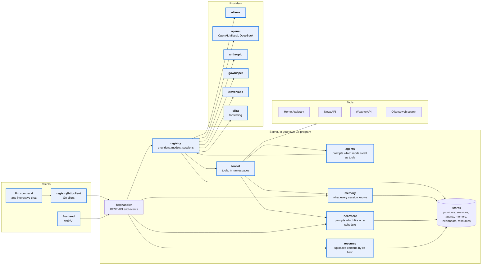

# go-llm

[](https://pkg.go.dev/github.com/mutablelogic/go-llm)
[](LICENSE)

go-llm is a server, command-line tool and Go SDK which puts large language models and speech models from several providers behind one interface. You add providers, such as Ollama, OpenAI, Anthropic, Mistral, [go-whisper](https://github.com/mutablelogic/go-whisper) and ElevenLabs, and then ask any of their models to reply to messages, call tools, run agents, embed text and images, read the text in documents, and transcribe and translate speech. The same operations are available as a REST API, from the `llm` command, which includes an interactive chat in the terminal, or directly from Go.

## Quick Start

### 1. Run the server, with Docker

The image has the server, and its web UI, and keeps its providers, sessions, agents and memory in the `/data` volume:

```bash
docker run -d --name llm -p 8084:8084 -v llm:/data \
  -e OLLAMA_ADDR=http://host.docker.internal:11434 \
  -e OPENAI_API_KEY \
  ghcr.io/mutablelogic/llm
```

Then open [http://localhost:8084/](http://localhost:8084/), to chat, and see the models and tools:


`host.docker.internal` is the machine Docker runs on, such as for an Ollama server which runs there, which Docker Desktop has, and Linux has with `--add-host=host.docker.internal:host-gateway`.

When it's first started, the server has the Eliza provider, unless `NO_ELIZA` is set, and those whose variables are set: `OLLAMA_ADDR` and `GOWHISPER_ADDR`, as their URLs, and `OPENAI_API_KEY`, `ANTHROPIC_API_KEY`, `DEEPSEEK_API_KEY`, `MISTRAL_API_KEY` and `ELEVENLABS_API_KEY`, whose keys are read from the container's environment when they're used, rather than stored. `UID` and `GID` set the user it runs as, such as the owner of a directory which is mounted at `/data`.

Or run it with Docker Compose, whose [compose file](docker/compose.yaml) has every variable the server reads, from the environment, or a `.env` file, and, with the `ollama` profile, an Ollama server, which `OLLAMA_ADDR=http://ollama:11434` adds:

```bash
docker compose -f docker/compose.yaml --profile ollama up -d
```

### 2. Install the command-line tool

The command-line tool, without the server, is built with the `client` tag. Install it with Go:

```bash
go install -tags client github.com/mutablelogic/go-llm/cmd/llm@latest
```

Or, in a clone of the repository, run `make client`, which builds it into `build/llm`.

It connects to the server at `localhost:8084`, or the one at `--http.addr`, or `LLM_ADDR`, such as `LLM_ADDR=nas.local:8084`.

### 3. Add providers

Providers which weren't added when the server was first started are added with the command-line tool. An API key is given by the name of its variable, as `--api-key-credential`, which the server reads from its own environment, which is the container's, rather than the command-line tool's, so the key isn't stored, or sent:

```bash
# Providers
llm provider-create-ollama http://host.docker.internal:11434
llm provider-create-openai --api-key-credential OPENAI_API_KEY
llm provider-create-anthropic --api-key-credential ANTHROPIC_API_KEY
llm provider-create-mistral --api-key-credential MISTRAL_API_KEY
llm provider-create-gowhisper http://host.docker.internal:8081
llm provider-create-elevenlabs --api-key-credential ELEVENLABS_API_KEY

# The providers, and their models, in order of name
llm providers
llm models

# The models which can do something, such as read images and call tools
llm models --capability vision,tools
```

### 4. Ask, and chat

Then ask models to do something. A command's model is kept, and used until another is given:

```bash
# Ask a question, and stream the reply
llm ask --model gpt-4o-mini "Explain a KV cache in two sentences"

# Ask about files: text, such as code, is sent as text, and an image or a
# PDF as an attachment, which the model must accept
llm ask --attach main.go "What does this do?"
llm ask --model gpt-4o -a chart.png -a notes.md "Do these agree?"

# Upload a file once, as a resource, and attach it by its URI, which a chat
# links to its session; a chat uploads the files it's given to its session
llm resource-create report.pdf
llm chat -a resource://<hash> "What does this say?"
llm ocr --model mistral-ocr-latest resource://<hash>

# Embed text, or an image
llm embed --model mistral-embed "A cat asleep in the sun"

# The text of a document, as Markdown
llm ocr --model mistral-ocr-latest report.pdf

# Speak text, as audio, in a voice
llm speak --model ollama:phonon:latest --voice Freya -o hello.wav "Hello, world"

# The speech in audio, as text, or as subtitles, with speakers
llm transcribe --model whisper-1 talk.m4a
llm transcribe --model voxtral-mini-latest --opt speakers=true --format srt talk.m4a

# Speech in any language, in English
llm translate --model whisper-1 interview.wav

# Download a model
llm model-load ollama:llama3.2
```

Or chat in a session, which the server keeps. A session is kept, and used until another is given:

```bash
# A session, with a model, a system prompt, and tools it can call
llm session-create --model ollama:llama3.2 --system "Be brief" --tools "weatherapi:*"

# Chat in the terminal, or ask once, in the session
llm chat
llm chat "Will it rain in Berlin tomorrow?"

# Its messages, and its sessions
llm session-messages
llm sessions
```

### Without Docker

Install the server and command-line tool, which are both `llm`, with Go, and run the server, which listens on `localhost:8084`, and keeps its data in the user's cache directory:

```bash
go install github.com/mutablelogic/go-llm/cmd/llm@latest
llm run
```

A server installed with `go install` serves the API, without the web UI, which `make`, from a clone of the repository, builds, with npm, into `build/llm`.

## Architecture


```mermaid
flowchart LR
    subgraph Clients
        direction TB
        CLI["`**llm** command
        and interactive chat`"]
        Client["`**registry/httpclient**
        Go client`"]
        UI["`**frontend**
        web UI`"]
    end

    subgraph Server["Server, or your own Go program"]
        direction TB
        API["`**httphandler**
        REST API and events`"]
        Registry["`**registry**
        providers, models, sessions`"]
        Toolkit["`**toolkit**
        tools, in namespaces`"]
        Agents["`**agents**
        prompts which models call as tools`"]
        Memory["`**memory**
        what every session knows`"]
        Heartbeat["`**heartbeat**
        prompts which fire on a schedule`"]
        Resource["`**resource**
        uploaded content, by its hash`"]
        Stores[("`**stores**
        providers, sessions, agents, memory, heartbeats, resources`")]
    end

    subgraph Providers
        direction TB
        Ollama["`**ollama**`"]
        OpenAI["`**openai**
        OpenAI, Mistral, DeepSeek`"]
        Anthropic["`**anthropic**`"]
        Whisper["`**gowhisper**`"]
        ElevenLabs["`**elevenlabs**`"]
        Eliza["`**eliza**
        for testing`"]
    end

    subgraph Tools
        direction TB
        HA["Home Assistant"]
        News["NewsAPI"]
        Weather["WeatherAPI"]
        Search["Ollama web search"]
    end

    CLI --> Client
    Client --> API
    UI --> API
    API --> Registry
    Registry --> Stores
    Registry --> Toolkit
    Toolkit --> Agents
    Toolkit --> Memory
    Agents --> Registry
    API --> Memory
    Memory --> Stores
    Toolkit --> Heartbeat
    API --> Heartbeat
    Heartbeat --> Stores
    API --> Resource
    Resource --> Stores
    Toolkit --> Tools
    Registry --> Ollama & OpenAI & Anthropic & Whisper & ElevenLabs & Eliza

    classDef highlight fill:#e8f0fe,stroke:#1a73e8,stroke-width:2px,color:#111
    class CLI,Client,UI,Registry,Toolkit,Agents,Memory,Heartbeat,Resource highlight
    class Ollama,OpenAI,Anthropic,Whisper,ElevenLabs,Eliza highlight
```

- The **client and CLI**: the `llm` command, in [cmd/llm](cmd/llm), runs the server, and is its client, with commands for each operation, and an interactive chat in the terminal, which streams replies and follows other clients of the same session. The Go client, [registry/httpclient](registry/httpclient), is what it uses to talk to the server.
- The **web UI**, in [frontend](frontend), which the server serves, when it's built with `make`, is a page to chat in sessions, with replies streamed, to see the models and tools, to add, edit and delete providers, whose API keys are given as the names of environment variables on the server, so the keys aren't stored, to load and delete models, and to create, edit and delete agents, as YAML, apart from the built-in ones, which can be copied.
- The **registry**, in [registry](registry), finds a model by name, checks what it can do, and asks its provider. It keeps providers, sessions and agents in stores, runs the agent loop, which calls tools until the model replies, and publishes events about what changed.
- The **toolkit**, in [toolkit](toolkit), holds the tools which models can call, in namespaces, such as `homeassistant` or `weatherapi`, and streams what they log, and their progress, as they run.
- The **memory**, in [memory](memory), is what every session and agent knows: the details of the person, and of the assistant, such as their names, where the person is, and their time zone and language, each known, not known, or declined, and memories, which are what a model keeps beyond the conversation, such as the person's preferences, or the people in their life, under keys. It's the toolkit's `memory` namespace, whose system prompt has the details, the time, and how to search, keep and use memories, and whose tools remember them.
- **Heartbeats**, in [heartbeat](heartbeat), are prompts for a session, which fire once, at a time, or again and again, on a schedule, such as a reminder, or a briefing each morning. A schedule is in its time zone, or the person's, which the memory has, so it follows them. It's the toolkit's `heartbeat` namespace, whose tool schedules them, and a heartbeat which fires is run, in a session of its own, whose identifier is the heartbeat's, with the model of the session it's for.
- **Resources**, in [resource](resource), are content, such as images, documents and audio, which is uploaded, kept once, by its SHA-256, and referred to as `resource://<hash>`. A resource is in a session, which it's deleted with, or on its own, when it's deleted once it hasn't been used for a day. Its manager keeps them in a store, such as files, or, later, a database.
- **Agents** are named prompts, with their model, tools and the schemas of their input and reply, which models call as tools in the `agent` namespace. The [agents](agents) folder has examples, which the server adds when it starts.
- The **providers**, in [provider](provider), each wrap a provider's API, and do what it can: generate, embed, read documents, or transcribe and translate speech.

The registry can be used without the server, from your own Go program, as the [examples](examples) show.

## Features

- **Providers**: add, update and remove providers while the server runs, and keep them in a store between restarts. A model is referred to by its name, or by its provider and name, such as `ollama:llama3.2:latest`.
- **Ask**: a model's reply to messages, with a system prompt, options, tools whose calls are returned for the caller to run, and structured output with a JSON schema. Replies can be streamed as server-sent events.
- **Chat**: a conversation with a model, in a session, which the server keeps, with its model, system prompt, tools, options and schema. The model calls the tools until it replies, and the conversation is shortened to fit its context. Chat in the terminal, in the web UI, or with the API, whose replies are streamed, and every client of a session sees its new messages, and whether someone is typing, or the model is replying.
- **Agents**: named definitions of a prompt, its input, and how a model is asked it, with its system prompt, tools, options and the schema of its reply, which are kept, in YAML or JSON, and which models call as tools, in the `agent` namespace, however deep, with their progress streamed, and their tokens counted as their caller's. The server adds example agents when it starts, such as one which translates text, and the `event` agent, which runs a heartbeat which fires, in its own session, with what the system says of the person and the time in a `<system-reminder>` block, and replies with what the person is told, and whether they're alerted, notified, or it's ignored.
- **Embed**: a vector for each message, of its text, and of images and audio for models which embed them.
- **OCR**: the text of images and documents, such as PDFs, as Markdown, page by page, with the regions of each page and their boxes.
- **Transcribe and translate**: the speech in audio, as text, in its language or in English, with timed segments and speakers, streamed as it's transcribed, and printed as SRT or WebVTT subtitles.
- **Models**: download, delete and unload models, for providers which store them, such as Ollama and go-whisper.
- **Tools**: a toolkit of tools, in namespaces, for Home Assistant, NewsAPI, WeatherAPI and Ollama's web search, which models can call.
- **Memory**: the details of the person, and of the assistant, such as their names, location, time zone and language, which every session knows, as a model learns them, or they're set, and which can be declined, so they're never asked for; and memories, which a model searches, keeps and forgets, as Markdown, under keys, with versions, so a change is made to a memory as it was last seen. The server keeps each memory in a file, which can be read, and edited, by hand.
- **Resources**: content, such as images, documents and audio, which is uploaded, or which a tool returns, as an MCP tool can, which is kept as a resource of the session the tool runs in, with a link to it in the tool's result, rather than its data, as a file, or the request's body, and streamed into the store, so a large file isn't held in memory, kept once, by its hash, however often it's uploaded, and downloaded, in ranges. A resource is in a session, and deleted with it, or on its own, and deleted once it hasn't been used for a day. Content which no resource refers to, and uploads which were interrupted, are cleaned up.
- **Heartbeats**: prompts for a session, which a model schedules, or the API, once, at a time, or on a schedule, as a cron expression, such as a reminder at six, or a briefing every weekday at eight, in a time zone, or the person's, which they follow, as it changes. When the clocks change, a time fires once, and a heartbeat which was due when the server wasn't running fires once, when it starts. One which won't fire again is deleted a week after it last fired. Servers which share a store fire a heartbeat once. A heartbeat which fires is run by the `event` agent, in a session of its own, with the model and tools of the session it's for, which replies with what the person is told, and how important it is. Its outcome is stored, as ignored, or pending, until it's delivered, which is next, and listed at `/llm/event`.
- **Events**: a stream of changes to the providers and their models, to sessions, with whether someone is typing in a session, or its model is replying, so two chat windows on one session follow each other, to the memory's details and memories, and to heartbeats, including when they fire.
- **OpenAPI**: the REST API is described by an OpenAPI specification, which `llm openapi` shows as documentation in a browser, or outputs as JSON or YAML.
- **OpenTelemetry**: traces of requests, through the registry, providers and tools.

## Providers

| Type | Provider | Generate | Embed | OCR | Transcribe | Translate | Speak | Models |
|------|----------|:--------:|:-----:|:---:|:----------:|:---------:|:-----:|--------|
| `ollama` | [Ollama](https://ollama.com) | ✅ | ✅ | ✅ (images) | | | ✅ (phonon) | Download, delete, unload |
| `openai` | [OpenAI](https://platform.openai.com) | ✅ | ✅ | | ✅ | ✅ (whisper) | ✅ (tts) | |
| `anthropic` | [Anthropic](https://www.anthropic.com)'s Claude models, which count tokens exactly, to fit a conversation to the model's context | ✅ | | | | | | |
| `openai` | [Mistral](https://mistral.ai), at `https://api.mistral.ai/v1` | ✅ | ✅ | ✅ | ✅ | | | |
| `openai` | [DeepSeek](https://www.deepseek.com), and other OpenAI-compatible servers | ✅ | | | | | | |
| `gowhisper` | [go-whisper](https://github.com/mutablelogic/go-whisper) | | | | ✅ | ✅ | | Download, delete |
| `elevenlabs` | [ElevenLabs](https://elevenlabs.io) | | | | ✅ | | | |
| `eliza` | A mock of Weizenbaum's 1966 chatbot, for testing | ✅ | | | | | | |

What a model can do depends on the model, which its provider reports, where it knows: such as whether it calls tools, thinks, sees images, or recognizes text. A request for something a model is known not to do is rejected before it's sent.

## CLI Commands

| Group | Commands |
|-------|----------|
| Server | `run`, `openapi` |
| Providers | `providers`, `provider`, `provider-create-ollama`, `provider-create-openai`, `provider-create-anthropic`, `provider-create-mistral`, `provider-create-deepseek`, `provider-create-gowhisper`, `provider-create-elevenlabs`, `provider-create-eliza`, `provider-update`, `provider-delete` |
| Models | `models`, `model`, `model-load`, `model-delete`, `model-unload` |
| Sessions | `sessions`, `session`, `session-messages`, `session-create`, `session-update`, `session-delete` |
| Inference | `ask`, `chat`, `embed`, `ocr`, `transcribe`, `translate`, `speak` |
| Events | `events` |
| Memory | `details`, `detail-set`, `detail-forget`, `memories`, `memory`, `memory-remember`, `memory-forget` |
| Heartbeats | `heartbeats`, `heartbeat`, `heartbeat-create`, `heartbeat-update`, `heartbeat-delete` |
| Resources | `resources`, `resource`, `resource-create`, `resource-get`, `resource-delete` |
| Tools and agents | `tools`, `tool`, `call`, `agents`, `agent`, `agent-create`, `agent-update`, `agent-delete` |

Run `llm <command> --help` for a command's arguments and flags. Options for a model are given with `--opt`, such as `--opt temperature=0.2`, or `--opt pages=0-2` for OCR.

A few options are for the agent loop, which asks a model, runs the tools it calls, and asks it again, rather than for the model's provider:

| Option | Default | |
|--------|---------|-|
| `max_iterations` | 10, or 3 for `ask` | The most times the model is asked for its reply. |
| `max_depth` | 3 | The most agents which run in one another, as a model calls an agent, which calls another, or itself. An agent can lower it, but not raise it. |
| `tool_timeout` | `30s` | The most time a tool has to return. |

They're given to a session, or an agent, such as `llm session-update --opt max_iterations=20 --opt max_depth=2`.

## Tools

Tools are added to the server's toolkit when their credentials, or settings, are set, as environment variables, or flags:

| Namespace | Tools | Credentials |
|-----------|-------|-------------|
| `memory` | Remember the details of the person, and the assistant, with the time in the system prompt, and search, keep and forget memories | None, as it's always added |
| `heartbeat` | Schedule, list, update and cancel heartbeats, which are prompts which come back to the conversation, at a time, or on a schedule | None, as it's always added |
| `llm` | `models`, `speak`, `ocr` and `transcribe` (which translates too): list the models with capabilities, such as `ocr` or `speech`, so the calling model can choose one, speak text, read the text in an image or document, and transcribe speech, with the model the calling model gives, or the default. Audio which is spoken is kept as a resource of the session, and images, documents and audio are read by their URIs, `resource://<hash>`, which the model is told for each attachment | None, as it's always added. Default models: `--llm.speak-model`, `--llm.speak-voice`, `--llm.ocr-model` and `--llm.transcribe-model`, or `LLM_SPEAK_MODEL`, `LLM_SPEAK_VOICE`, `LLM_OCR_MODEL` and `LLM_TRANSCRIBE_MODEL` |
| `weatherapi` | Current weather, forecasts and alerts | `WEATHERAPI_API_KEY`, from [weatherapi.com](https://www.weatherapi.com/signup.aspx) |
| `newsapi` | News articles, headlines and sources | `NEWSAPI_API_KEY`, from [newsapi.org](https://newsapi.org/register) |
| `homeassistant` | Query, and search, and control smart home devices | `HOMEASSISTANT_URL`, `HOMEASSISTANT_API_KEY` |
| `ollama` | Web search and fetch, with Ollama's cloud service, rather than a local Ollama | `OLLAMA_API_KEY`, from [ollama.com](https://ollama.com/settings/keys) |

A model is given tools by name, by namespace and name, such as `weatherapi:current`, or all of a namespace's, such as `weatherapi:*`, or all of them, `*`.

## API

The server's REST API is under `/api`, and documented in [registry/httphandler/README.md](registry/httphandler/README.md), with its events in [broadcaster/httphandler/README.md](broadcaster/httphandler/README.md), the memory's in [memory/httphandler/README.md](memory/httphandler/README.md), the heartbeats' in [heartbeat/httphandler/README.md](heartbeat/httphandler/README.md), and the resources' in [resource/httphandler/README.md](resource/httphandler/README.md), and as OpenAPI, with `llm openapi`. Inference which streams, such as ask and transcribe, sends server-sent events when `text/event-stream` is accepted.

## Go

The packages can be used without the server:

- [`llm`](https://pkg.go.dev/github.com/mutablelogic/go-llm): the interfaces of providers and models, and what they do: `Generator`, `Embedder`, `Recognizer`, `Transcriber` and `Downloader`, and the options for them.
- [`provider/...`](provider): a client for each provider, which implements the interfaces it can.
- [`registry`](registry): the registry of providers, which finds a model by name, checks what it can do, and asks its provider, with a store, events, and HTTP handlers and a client.
- [`toolkit`](toolkit): the toolkit of tools, which a model calls.
- [`memory`](memory): the memory, which is a namespace of the toolkit, with a store, events, and HTTP handlers and a client.
- [`heartbeat`](heartbeat): the heartbeats, which are a namespace of the toolkit, with a store, events, `Run`, which fires them, and HTTP handlers and a client.
- [`broadcaster`](broadcaster): publishes events, which are changes, to the channels which watch them, with an HTTP handler which streams them as server-sent events, and a client.

The registry is meant to be composed with other modules into a whole system, rather than to be one itself. It's created with options, which plug in what a system has:

- `WithProviderStore` keeps the providers' definitions in a store, such as a database, so they're kept when the server restarts, and are shared between servers. A `ProviderStore` lists, puts and deletes providers, each with a serial, so a change to a provider which another server has changed is a conflict, and watches the store for the changes other servers make. The providers' models aren't stored, as they're listed from the providers, and cached.
- `WithSessionStore` keeps sessions, which are conversations with models, in a store, such as a database, so they're kept when the server restarts. A `SessionStore` creates, gets, lists, puts and deletes sessions, each with a UUID and a serial, which the store sets, so a change to a session which was changed since it was read is a conflict, and watches the store for the changes other servers make. Without one, the registry's session methods return `ErrServiceUnavailable`.
- `WithAgentStore` keeps agents, which are prompts with a model, tools and a schema of their input and reply, in a store, such as a database or files, so they're kept when the server restarts. An `AgentStore` creates, gets, lists, puts and deletes agents, each with its name and a serial, so a change to an agent which was changed since it was read is a conflict. The registry's agents are tools in the toolkit's `agent` namespace, which models can call. Without one, the registry's agent methods return `ErrServiceUnavailable`.
- `WithCredentialsProvider` expands an API key's placeholder, such as `${OPENAI_KEY}`, with a secret, from the environment by default, or from a secrets manager, so keys are never stored.
- `WithToolkit` gives the registry the tools which models can call.
- `WithBroadcaster` gives the registry the broadcaster which it publishes its events to, such as one which a system's other modules share, so their events are streamed together. Without one, the registry has its own.
- `WithTracer` and `WithClientOpts` trace, and configure, the requests to providers.

Its HTTP handlers are registered with a router, alongside a system's own, and its events, such as a provider being created, or a session's model replying, are watched with `Watch`. The `llm` command, in [cmd/llm](cmd/llm), is one such system: it runs the registry, with a store which keeps its providers in the command's defaults, and its sessions and agents in files, the toolkit, and a broadcaster, which streams the registry's events, in a server.

The [examples](examples) use the packages without the server, each with Ollama, when `OLLAMA_ADDR` is set, OpenAI, when `OPENAI_API_KEY` is, or Eliza, which needs neither:

| Example | |
|---------|-|
| [ask](examples/ask) | Ask a model a question, and stream its reply |
| [tools](examples/tools) | A tool of your own, in a toolkit, which the registry runs as the model calls it |
| [chat](examples/chat) | Chat in the terminal, with the conversation kept in memory |
| [agent](examples/agent) | Run the example agent which translates text, which replies with JSON |
| [ocr](examples/ocr) | Read the text in an image, or a PDF, as Markdown, with Mistral or Ollama |
| [transcribe](examples/transcribe) | Transcribe, or translate, the speech in audio, with OpenAI, Mistral, go-whisper or ElevenLabs |

```bash
go run ./examples/ask "Explain a KV cache in two sentences"
```

## Development

```bash
make vet race-test TEST_FLAGS=-short   # As CI runs the tests
make test                              # All the tests, with coverage
```

Tests which make requests to a provider are skipped with `-short`, and unless its credentials are set, such as `OPENAI_API_KEY`, `ANTHROPIC_API_KEY`, `MISTRAL_API_KEY` or `ELEVENLABS_API_KEY`, or its address, such as `OLLAMA_ADDR` or `GOWHISPER_ADDR`.

## Roadmap

### Sessions

- **Compaction**: a session's conversation is compacted, so it doesn't grow without end, and each request doesn't trim the same messages again.
  - **Markers**: a message in a session which says its context starts there. The messages before the last marker aren't sent to the model, but are kept, so the UI still shows them, with a divider at each marker.
  - **Summaries in the background**: a marker is added at once, and a built-in `compact` agent then writes a summary of what came before it, in the background, which is added to the marker. The summary is sent first in the context, in a `<system-reminder>` block, so the model knows what was said. Until it's written, the model has only what's after the marker.
  - **When markers are added**: automatically, once a reply is stored, when the conversation fills more than about 80% of the model's context, and when it's asked for, with `POST /llm/session/{id}/compact`, and a Compact action in the chat. An event's session has a marker before each run, so a run sees only itself, and a summary of the runs before it.
  - **Forgetting**: forgetting a session's messages could add a marker, without a summary, rather than delete them, so they're kept.
  - The trimming each request does now, which drops tools' results, and the oldest turns, stays, for what's after the marker, so a conversation still fits the model's context while its summary is written.

### Agents and tools

- **MCP**: connectors to MCP servers, whose tools are added to the toolkit, each in its own namespace, so models can call them.
- **Heartbeats which are asked**: the prompt of a heartbeat which fires is asked of its session's model, as a message which says it's scheduled, with a history of what ran, and agents which run on a schedule.
- **Events between servers**: servers which share stores, such as a database, share their events, so a client of one sees the changes, and fires, of another.

### Providers

- **Google Gemini**, which the earlier version of go-llm had, for generation, and its embeddings.
- **LM Studio**, which runs models locally, as Ollama does, with its own API to list, download, delete, load and unload them, as well as an OpenAI-compatible API.
- **ElevenLabs' voices, and images**: text to speech with ElevenLabs, and image generation, such as with OpenAI's `gpt-image` models.
- **OpenAI's Responses API**, so OpenAI's newest models can think while they call tools, and the models which only it has can be used.
- **OpenAI's token limits**, which are from memory, and should be checked.

### Improvements

- **Attachments by URL**: a message's image or document by its URL, rather than its data, which the server doesn't yet read, as it shouldn't fetch any URL it's given.
- **OCR**: the images in documents, PDFs with Ollama's models, and `glm-ocr`'s prompt, which isn't tested.
- **Speech**:
  - Speakers with go-whisper's diarizing model, which only knows when the speaker changes.
  - ElevenLabs' realtime transcription, over a WebSocket.
  - Translation with models which hear audio in a conversation, such as Voxtral Small.
  - Subtitles whose lengths can be set.

## License

go-llm is licensed under the [Apache License, Version 2.0](LICENSE).
